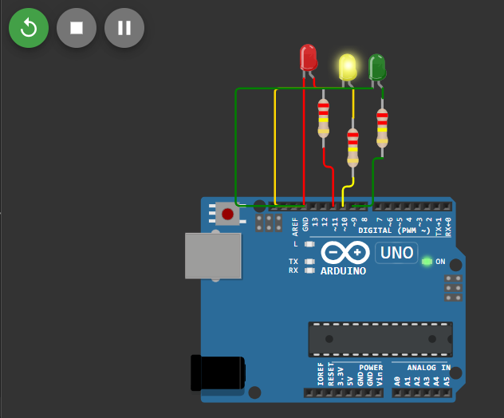
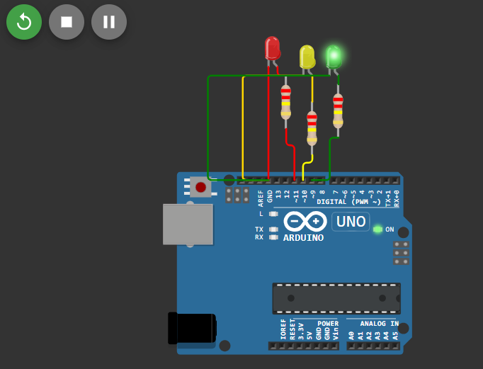
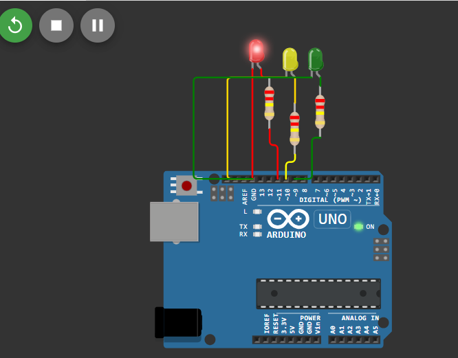

# Projeto com Arduino 

Este projeto foi desenvolvido no simulador online Wokwi para atender aos requisitos da atividade de aula, demonstrando a aplicação dos conceitos de Programação Orientada a Objetos (POO) em um microcontrolador Arduino.

## Solução Implementada

### 1. Hardware e Circuito

O projeto é um controlador de LEDs Sequencial

| Componente | Conexão (Pino Digital) | Função |
| :--------- | :--------------------- | :----- |
| LED Vermelho | D11 | Sinalização de 'Pare' |
| LED Amarelo | D10 | Sinalização de 'Atenção' |
| LED Verde | D9 | Sinalização de 'Siga' |
| Resistores | 3x (220 $\Omega$) | Limitar a corrente de cada LED (um resistor por LED) |
| GND | Comum | Cátodo de todos os LEDs |

## Prints do Circuito

